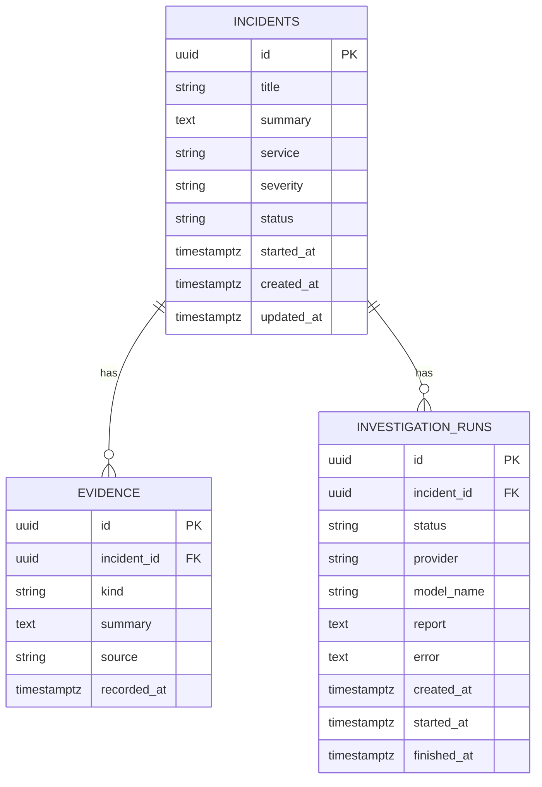

# Schema design

Product: Case file  
Database: PostgreSQL 16  
Schema revision: `0002_actors`  
Status: implemented

This document is the contract for the case record. The console, API, and worker all read and write these tables. External systems (logs, CloudWatch, Datadog, GitHub) are not copied into this database. A tool returns a result, and the case keeps only the short fact that was recorded.

The CLI path that writes `.case/case.json` is outside this schema.

## 1. Relations

An incident is the root. Evidence and investigation runs belong to exactly one incident. Deleting an incident deletes its evidence and its runs.



| Relation | Cardinality | Rule |
| --- | --- | --- |
| Incident to evidence | 1 to 0..n | `evidence.incident_id` references `incidents.id` with `ON DELETE CASCADE` |
| Incident to investigation run | 1 to 0..n | `investigation_runs.incident_id` references `incidents.id` with `ON DELETE CASCADE` |
| Incident to active run | 1 to 0..1 | Partial unique index `uq_incident_active_run` on `incident_id` where `status IN ('queued', 'running')` |
| Evidence to run | none | A fact belongs to the case, not to the run that found it. `source` records who wrote it |

There is no join table. Identity is a UUID primary key generated by the application (`uuid4`). PostgreSQL does not assign these keys.

## 2. Tables

### 2.1 `incidents`

The case a person opens and later closes.

| Column | Type | Null | Meaning |
| --- | --- | --- | --- |
| `id` | `uuid` | no | Primary key |
| `title` | `varchar(200)` | no | Short name of the case |
| `summary` | `text` | no | What is already known. This text is sent to the model |
| `service` | `varchar(120)` | no | Affected service, for example `checkout-api` |
| `severity` | `varchar(8)` | no | `sev1`, `sev2`, `sev3`, or `sev4` |
| `status` | `varchar(20)` | no | `open`, `investigating`, `mitigated`, or `resolved` |
| `started_at` | `timestamptz` | no | When the incident started, as stated by the person who opened it |
| `created_at` | `timestamptz` | no | When the row was inserted |
| `updated_at` | `timestamptz` | no | When the case, its evidence, or its status last changed |
| `opened_by` | `varchar(200)` | no | Subject of the person who opened the case. Empty on rows created before sign-in existed |

Checks: `ck_incident_severity`, `ck_incident_status`.

`started_at` and `created_at` are different. A case opened at 14:10 about an error that began at 14:02 stores 14:02 in `started_at`.

The list API orders cases by `started_at` descending. There is no secondary index on `started_at` in revision `0001_case_file`.

### 2.2 `evidence`

Facts kept on the case: symptoms, log lines, timeline entries, changes, and hypotheses.

| Column | Type | Null | Meaning |
| --- | --- | --- | --- |
| `id` | `uuid` | no | Primary key |
| `incident_id` | `uuid` | no | Parent case |
| `kind` | `varchar(20)` | no | `symptom`, `log`, `timeline`, `change`, or `hypothesis` |
| `summary` | `text` | no | The fact, in one or two sentences |
| `source` | `varchar(200)` | no | Who or what produced the fact. The console writes the signed-in subject. The agent may name a tool or system |
| `recorded_at` | `timestamptz` | no | When this row was inserted |

Check: `ck_evidence_kind`. Index: `ix_evidence_incident_id`.

Reads for one case are ordered by `recorded_at` ascending. That order is the timeline the console and the next investigation prompt use.

Raw log files are not stored. A `log` row is the line or conclusion that was worth keeping.

### 2.3 `investigation_runs`

One execution of Investigate. The same case may be investigated again after a previous run has finished. The console shows every run, newest first. The note on screen is `report` from the latest completed run.

| Column | Type | Null | Meaning |
| --- | --- | --- | --- |
| `id` | `uuid` | no | Primary key |
| `incident_id` | `uuid` | no | Parent case |
| `status` | `varchar(20)` | no | `queued`, `running`, `completed`, or `failed` |
| `provider` | `varchar(32)` | no | `ollama` or `bedrock`. Empty until the worker starts the run |
| `model_name` | `varchar(512)` | no | Model id recorded when the run is queued, then confirmed when it starts |
| `requested_by` | `varchar(200)` | no | Subject of the person who clicked Investigate |
| `report` | `text` | yes | Incident note. Set only when `status` is `completed` |
| `error` | `text` | yes | Failure text, truncated to 2000 characters. Set only when `status` is `failed` |
| `created_at` | `timestamptz` | no | When the API queued the run |
| `started_at` | `timestamptz` | yes | When the worker claimed the run |
| `finished_at` | `timestamptz` | yes | When the worker stored `completed` or `failed` |

Check: `ck_run_status`.

Indexes:

| Name | Columns | Purpose |
| --- | --- | --- |
| `ix_investigation_runs_incident_id` | `incident_id` | Load the history of one case |
| `ix_investigation_runs_status` | `status` | Find queued work |
| `uq_incident_active_run` | `incident_id` unique where `status IN ('queued', 'running')` | One in-flight investigation per case |

The worker claims work with:

```sql
SELECT *
FROM investigation_runs
WHERE status = 'queued'
ORDER BY created_at
LIMIT 1
FOR UPDATE SKIP LOCKED;
```

`SKIP LOCKED` lets a second worker take the next queued row instead of waiting on the row the first worker holds. One worker is the current deployment. The claim query is already safe for more than one.

## 3. State

Two independent state fields. The database checks the allowed values. The application decides which value is written.

### Incident

| From | To | Who writes it |
| --- | --- | --- |
| (insert) | `open` | API, when the case is created |
| `open` | `investigating` | Worker, when it claims the run |
| `investigating` | `open` | Worker, when the run completes or fails |
| any allowed value | `open`, `investigating`, `mitigated`, or `resolved` | A person, through `PATCH /api/incidents/{id}` |

A person marks `mitigated` and `resolved`. The worker does not. If a person has already moved the case off `investigating` before the run finishes, the worker leaves that status in place.

`POST /api/incidents/{id}/investigate` returns 409 when `status` is `resolved`, and when an active run already exists.

### Investigation run

| From | To | Columns set |
| --- | --- | --- |
| (insert) | `queued` | `created_at`, `provider`, `model_name` |
| `queued` | `running` | `started_at` |
| `running` | `completed` | `finished_at`, `report` |
| `running` | `failed` | `finished_at`, `error` |

A missing parent case at execution time sets the run to `failed` with `error` = `Case not found.`

Finished runs stay on the case. A later Investigate inserts a new row. The partial unique index rejects a second `queued` or `running` row for the same `incident_id`. The API turns that integrity error into HTTP 409.

## 4. Use cases and the rows they write

Each use case below is a data operation on this schema. Product narrative for the same cases is in `scope-and-use-cases.md`.

### UC-1 Open a case after a deploy

Harbor and Co. checkout starts returning HTTP 500 after payments-api 1.42.0. The on-call engineer opens a case.

| Write | Value |
| --- | --- |
| `incidents` insert | `service` = `checkout-api`, `severity` = `sev1`, `status` = `open`, `started_at` = 14:02 UTC, `summary` = the symptom they typed, `opened_by` = the signed-in subject |
| `evidence` | none yet |
| `investigation_runs` | none yet |

Relation used: the incident stands alone. Evidence and runs are optional.

### UC-2 Record a fact the engineer already knows

Someone adds "database failover was not announced" before or during the investigation.

| Write | Value |
| --- | --- |
| `evidence` insert | `incident_id` of the open case, `kind` = `change` or `timeline`, `source` = the signed-in subject, `summary` = that statement |
| `incidents.updated_at` | set to the insert time |

The next run reads every evidence row for that `incident_id`, ordered by `recorded_at`, and includes them in the prompt. The agent must not contradict a recorded fact without saying so. That rule is in the prompt, not in a database constraint.

### UC-3 Investigate

The engineer clicks Investigate. The HTTP request does not wait for the model.

| Step | Write |
| --- | --- |
| API accepts | `investigation_runs` insert, `status` = `queued`, `incident_id` set, `requested_by` = the signed-in subject. Response 202 |
| API rejects | no insert, when the case is `resolved` or `uq_incident_active_run` would be violated |
| Worker claims | that row becomes `running`; if the incident is `open`, it becomes `investigating` |
| Agent calls `record_evidence` | `evidence` insert on the same `incident_id`. `kind` is one of the five allowed values. `source` is whatever the model passed, default `operator` |
| Agent calls `search_logs` | no database write. Matching lines stay in the tool result |
| Success | run `status` = `completed`, `report` = the note, `finished_at` set. Incident returns to `open` if it is still `investigating` |
| Failure | run `status` = `failed`, `error` set, `report` left null. Same incident status rule |

Relation used: one incident, many evidence rows, exactly one active run. Log lines quoted in `report` or in an evidence `summary` are not a foreign key to a log store.

### UC-4 Correlate a deploy when the only stored input is the case

The symptom is a latency jump. GitHub is not a table in this schema. If that plugin is off, no deploy rows appear.

| Stored | Not stored |
| --- | --- |
| Incident `summary` and `started_at` | Commit list |
| An evidence row of `kind` = `change` only if a person or the agent records one | The deploy system itself |

The note in `investigation_runs.report` is expected to say the deploy list is unknown when no change was recorded and no deploy tool ran.

### UC-5 Close the case

The engineer rolls back and marks the case mitigated, then resolved when the error rate recovers.

| Write | Value |
| --- | --- |
| `incidents.status` | `mitigated`, later `resolved` |
| `incidents.updated_at` | time of the patch |
| `investigation_runs` | unchanged. The note remains the record of what the agent concluded |

A resolved case cannot queue another run until a person changes `status` away from `resolved`.

### UC-6 Investigate again

New evidence arrives after a completed or failed run. The engineer clicks Investigate a second time.

| Write | Value |
| --- | --- |
| New `investigation_runs` row | `status` = `queued`, same `incident_id` |
| Previous run | left as `completed` or `failed`, with its `report` or `error` |
| Evidence | the new prompt includes every existing evidence row, from the operator and from the earlier run |

The partial unique index allows this because the earlier row is no longer `queued` or `running`.

### UC-7 Two companies, two databases

Company A and Company B run the same images. Each has its own PostgreSQL database. There is no tenant column. Isolation is a separate database per deployment, not a row predicate.

## 5. What this schema does not store

| Concern | Where it lives |
| --- | --- |
| Log files, metrics, commits | Company systems, reached by tools. Not replicated here |
| Model transcript and tool-call trace | Not persisted. Only `report` and evidence rows are kept |
| A history of every status edit | Not stored. `opened_by` and `requested_by` record who opened the case and who clicked Investigate |
| Approval before a write to GitHub, Kubernetes, or Datadog | Not in this schema. Those writes are out of product scope |
| Multi-tenant company id | Out of scope. One deployment, one database |

## 6. Revision

`alembic/versions/0001_case_file.py` creates the three tables, the four check constraints, the foreign keys, and the indexes in section 2. `0002_actors` adds `incidents.opened_by` and `investigation_runs.requested_by`. The API image runs `alembic upgrade head` before it serves traffic. The worker waits until `investigation_runs` can be selected.
