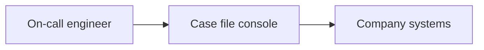
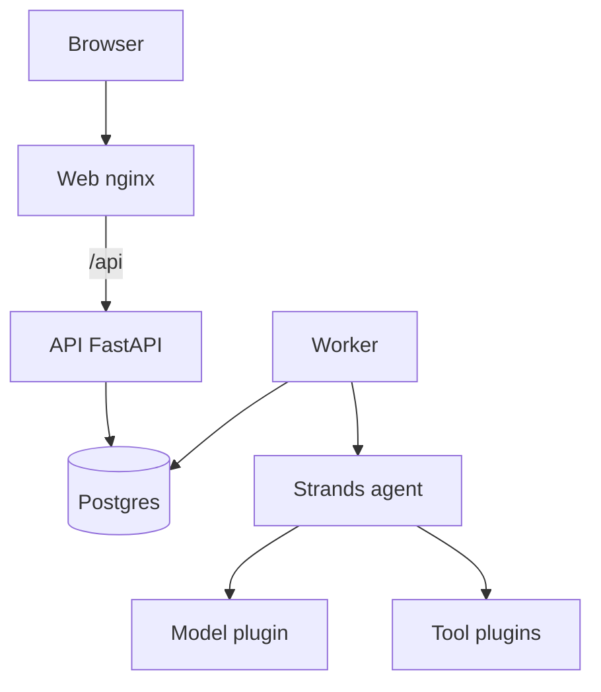
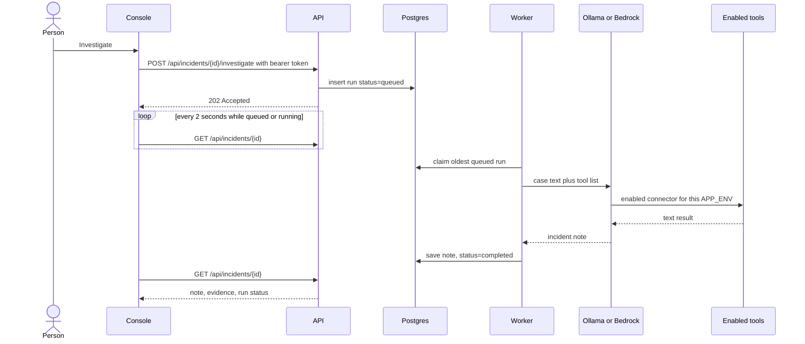

# System design

Case file is one investigation product with two replaceable edges: the model, and the tools. A company keeps the case record and swaps those edges.

## Context



The person never talks to CloudWatch or GitHub directly through this product. They talk to the case. The worker talks to company systems only through enabled tool plugins.

`APP_ENV=local` puts a directory of log files behind the tools. `APP_ENV=prod` puts CloudWatch, Datadog, Loki, and GitHub behind them. Slack and PagerDuty are not connected.

## Containers



| Piece | Responsibility |
| --- | --- |
| Browser | Sign in, open a case, read the note, change status |
| Web | Static console. Proxies `/api` to the API. Sends the bearer token |
| API | Checks the token and the service grant, then cases, notes, status, and queues an investigation. Does not call the model |
| Worker | Claims a queued run, calls the agent, stores the note |
| Postgres | Cases, evidence, runs. Also the job queue, using a row status and `FOR UPDATE SKIP LOCKED` |
| Strands agent | Loop: send the case, run a tool the model asked for, send the tool result back |
| Model plugin | Ollama or Bedrock |
| Tool plugins | Case file, plus `APP_ENV=local` log folder or `APP_ENV=prod` CloudWatch, Datadog, Loki, and GitHub |

## What happens when someone clicks Investigate



The text sent to the model is not the title alone. The worker builds it from the case:

```text
Incident: <title>
Service: <service>
Severity: <severity>
Started: <started at>
What we know: <summary>
Evidence already recorded:
- ...
Start by calling search_logs.
```

`search_logs` then reads files under `LOG_DIR/<service>`. In the local stack a checkout case reads `/app/examples/logs/checkout-api/api.log`. A case for another service cannot read that directory.

## Plugin shape

The agent is constructed in one place: `build_agent`. It receives a model object and a list of tools. Everything else in the product stays fixed.

```text
enabled model  -----> Strands Agent -----> incident note
enabled tools  -----^
case brief     -----^
```

Target layout, so a company can add a system without editing the console:

```text
src/incident_investigation_agent/
  services/agent.py              builds the Strands agent
  infrastructure/llm.py          chooses ollama or bedrock
  infrastructure/tools.py        case-file tools, always on
  infrastructure/logs.py         local log search
  infrastructure/connectors/
    local_logs.py                APP_ENV=local
    cloudwatch.py                APP_ENV=prod
    datadog.py                   APP_ENV=prod
    loki.py                      APP_ENV=prod
    github.py                    APP_ENV=prod
    registry.py                  reads APP_ENV and CONNECTORS
```

A connector module exposes a function:

```text
tools_for(settings) -> list of Strands tools
```

`APP_ENV=local` enables `local_logs`. `APP_ENV=prod` enables `cloudwatch`, `datadog`, `loki`, and `github`. `CONNECTORS=cloudwatch,github` replaces that default. An unknown name fails at startup with the list of known names. A connector whose setting is missing returns that missing name from the tool, and the case stays usable.

The case-file tools `record_evidence` and `list_evidence` stay on for every company. They write to this product's database, not to the company's other systems.

## Data the case stores

Column types, keys, the partial unique index, and the use cases that write each relation are specified in [schema design](schema-design.md). Summary:

```text
incidents
  id, title, summary, service, severity, status, started_at

evidence
  incident_id, kind, summary, source, recorded_at
  kind: symptom | log | timeline | change | hypothesis

investigation_runs
  incident_id, status, provider, model_name, report, error
  status: queued | running | completed | failed
```

One case may have many runs. The console shows the latest. One case may have at most one queued or running run.

External systems are not copied into Postgres wholesale. A plugin returns the lines or commits the model asked for, and `record_evidence` stores the short fact the model decided to keep.

## Deployment shapes

Local, one company, one laptop:

```text
docker compose
  postgres
  api + worker   MODEL_PROVIDER=ollama
                 OLLAMA_HOST=http://host.docker.internal:11434
  web            http://localhost:8080
Ollama on the host, any pulled tool-capable model
```

Production, that company's cloud:

```text
same images
MODEL_PROVIDER=bedrock
AWS credentials from the task role or a secret
DATABASE_URL from a secret
LOG_DIR or CONNECTORS pointed at that company's systems
web behind the company's HTTPS endpoint
```

The console, API, worker, and schema stay the same. The company changes environment variables and which connector packages are enabled.

## What is intentionally not in the design yet

- A bus between API replicas. One worker polling Postgres is enough for a single company deployment.
- Write access to GitHub, Kubernetes, or Datadog. A later approval record would sit between the agent and any write.
- A hosted multi-tenant control plane. Each company runs its own database.
