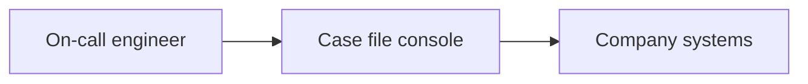
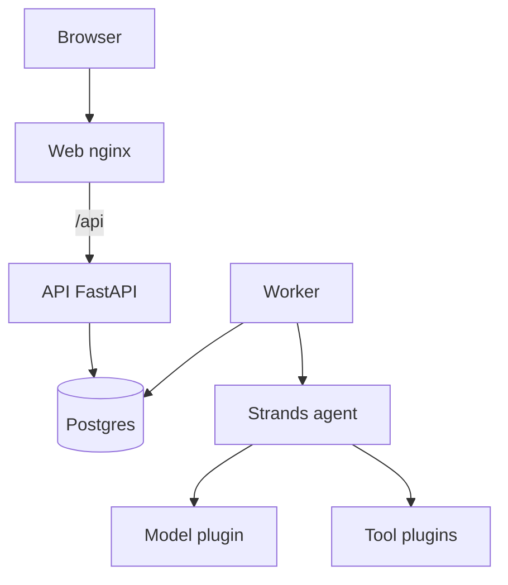
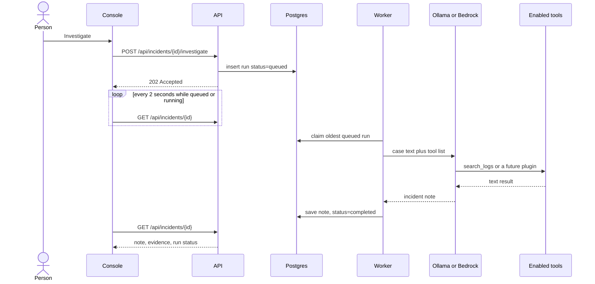

# System design

Case file is one investigation product with two replaceable edges: the model, and the tools. A company keeps the case record and swaps those edges.

## Context



The person never talks to CloudWatch or GitHub directly through this product. They talk to the case. The worker talks to company systems only through enabled tool plugins.

Today the only company system behind a tool is a directory of log files.

## Containers



| Piece | Responsibility |
| --- | --- |
| Browser | Open a case, read the note, change status |
| Web | Static console. Proxies `/api` to the API |
| API | Cases, notes, status, queue an investigation. Does not call the model |
| Worker | Claims a queued run, calls the agent, stores the note |
| Postgres | Cases, evidence, runs. Also the job queue, using a row status and `FOR UPDATE SKIP LOCKED` |
| Strands agent | Loop: send the case, run a tool the model asked for, send the tool result back |
| Model plugin | Ollama or Bedrock |
| Tool plugins | Today: local log search, record evidence, list evidence |

## What happens when someone clicks Investigate



The text sent to the model is not the title alone. The worker builds it from the case:

```text
Incident: <title>
Service: <service>
Severity: <severity>
Started: <started at>
What we know: <summary>
Evidence already recorded:
- ...
Start by calling search_logs.
```

`search_logs` then reads files under `LOG_DIR`. In the local stack that is `/app/examples/logs/api.log`.

## Plugin shape

The agent is constructed in one place: `build_agent`. It receives a model object and a list of tools. Everything else in the product stays fixed.

```text
enabled model  -----> Strands Agent -----> incident note
enabled tools  -----^
case brief     -----^
```

Target layout, so a company can add a system without editing the console:

```text
src/incident_investigation_agent/
  services/agent.py              builds the Strands agent
  infrastructure/llm.py          chooses ollama or bedrock
  infrastructure/tools.py        case-file tools, always on
  infrastructure/logs.py         local log search, built
  infrastructure/connectors/
    cloudwatch.py                planned
    datadog.py                   planned
    github.py                    planned
    registry.py                  reads CONNECTORS and returns the tool list
```

A connector module exposes a function:

```text
tools_for(settings) -> list of Strands tools
```

`CONNECTORS=local_logs,github` turns those modules on. An unknown name fails at startup with the list of known names. A connector whose secret is missing fails the run with that missing setting, and the case stays usable.

The case-file tools `record_evidence` and `list_evidence` stay on for every company. They write to this product's database, not to the company's other systems.

## Data the case stores

```text
incidents
  id, title, summary, service, severity, status, started_at

evidence
  incident_id, kind, summary, source, recorded_at
  kind: symptom | log | timeline | change | hypothesis

investigation_runs
  incident_id, status, provider, model_name, report, error
  status: queued | running | completed | failed
```

One case may have many runs. The console shows the latest. One case may have at most one queued or running run.

External systems are not copied into Postgres wholesale. A plugin returns the lines or commits the model asked for, and `record_evidence` stores the short fact the model decided to keep.

## Deployment shapes

Local, one company, one laptop:

```text
docker compose
  postgres
  api + worker   MODEL_PROVIDER=ollama
                 OLLAMA_HOST=http://host.docker.internal:11434
  web            http://localhost:8080
Ollama on the host, any pulled tool-capable model
```

Production, that company's cloud:

```text
same images
MODEL_PROVIDER=bedrock
AWS credentials from the task role or a secret
DATABASE_URL from a secret
LOG_DIR or CONNECTORS pointed at that company's systems
web behind the company's HTTPS endpoint
```

The console, API, worker, and schema stay the same. The company changes environment variables and which connector packages are enabled.

## What is intentionally not in the design yet

- A bus between API replicas. One worker polling Postgres is enough for a single company deployment.
- Write access to GitHub, Kubernetes, or Datadog. A later approval record would sit between the agent and any write.
- A hosted multi-tenant control plane. Each company runs its own database.
